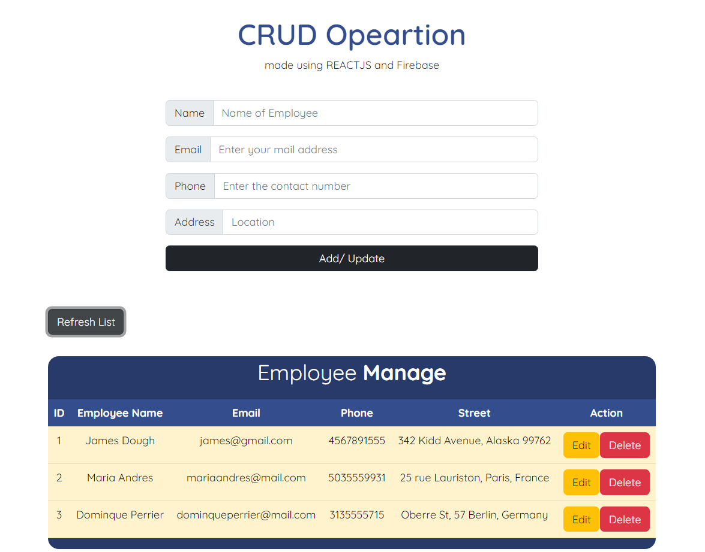
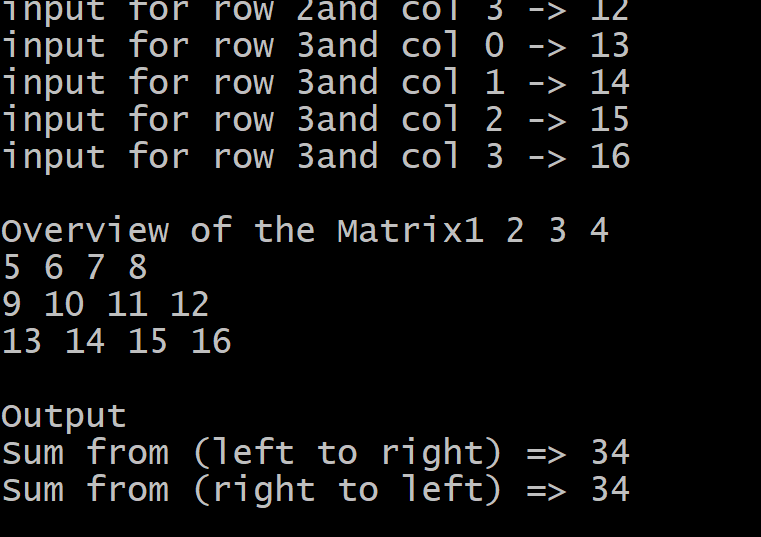

#SentitentGeeks Assessment

This repository has two solution as per given in the question.

- CRUD Application
- Sum of the diagonal of a Square Matrix

#### ⭐ (Problem 01) CRUD APPLICATION

- This application performs the CRUD operations
- The app is made upon REACT-JS.
- The Database which i have used is Google Firebase
- **Tech Stack :** REACTJS ,Firebase, JSX, CSS

##### 🛠 Installation Process

**PREREQUISITE:** NODEJS and VS-CODE

1. First clone the repository from the github.
2. Then go to the _crud_operation_ folder
3. Then run the command to install the Node Dependencies
   `npm install`
4. After that simply run the application, using
   `npm start`
5. All set you are ready to use the application

### Demo

Interface of the application

Database Screenshot

---

#### ⭐ (Problem 02) MATRIX MULTIPLICATION

The whole code is written in Java.
**Instruction**

1. Compile the code `javac Matrix_Problem.java`
2. Run the code `java Main`
3. Give the size of the matrix (example: 4)
4. Give the input for each index
5. And you are done

Output of the code

---

**> Thank you for visiting my profile, I hope you have a great day** 😊
